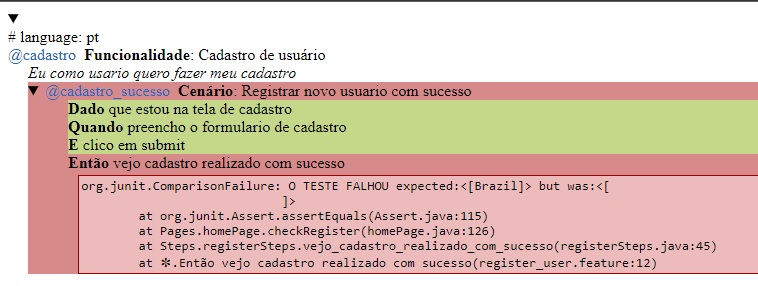
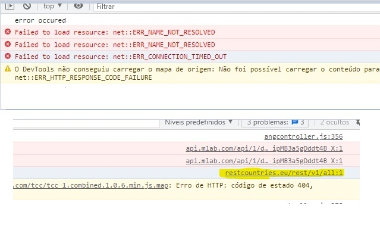

# Projeto Bravi - Avaliação

Esse projeto faz parte de uma avaliação para BRAVI.

Foi realizado no site http://demo.automationtesting.in/Register.html. Na qual, a automação visa registrar um usuário.

Escrito usando o Framework Selenium Webdrive com Linguagem Java e para o gerenciamento das dependencias o Maven.

<h3>Resume</h3>
<h3>Bug</h3>

<h1> Site da Automação</h1>

<h4>Resume</h4>

 A estrutura da automação esta baseada em Page Objets. Sendo em 4 pastas:
    Pages, Run, Steps e Support

Pages: encontra-se toda a estrutura dos códigos de testes; 
Run: encontra-se a classe que executa o teste; 
Steps: encontra-se os passos dos testes de acordo com o BDD; 
Support: encontra-se algumas ferramentas para utilização no código. 

Na estrutura também existe a pasta feature que esta o BDD

O relatório simplificado dos passos do teste está na pasta target\reports\
Vale ressaltar que devido ao erro encontrado, o Assert para o step foi comprometido, pois o texto não foi localizado para validar.

Não foi possível concluir 100% dos cenários, foi detectado uma falha na página, conforme tópico "Bug".

<h4>Bug</h4>

 Foi detectado uma falha no campo "Country*". Esse campo não tem a lista para preenchimento. Deveria aparecer lista ao clicar.
  

  

  

 Ponto de melhoria:

Uma sugestão que seria passada aos desenvolvedores é para melhoria no campo do telefone no formulário do site.
  
Que informasse ao usuário o formato correto do preenchimento do telefone. Ex: +55 (DDD) x xxxxxxxx

